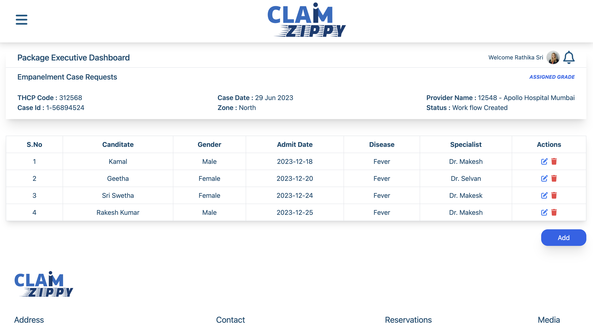

# My React CRUD Project

## Live Link
The live version of this project can be accessed [here](https://calm-mousse-ae068d.netlify.app/).

## Description
This project implements CRUD (Create, Read, Update, Delete) operations using React in the frontend. It utilizes Tailwind CSS for styling, Font Awesome for icons, and React Icons for additional icon support.



## Installation

### React Setup
1. **Initialize React App**: Run the following command to create a new React app:
   ```bash
   npx create-react-app my-app
   cd task

# Getting Started with Create React App

This project was bootstrapped with [Create React App](https://github.com/facebook/create-react-app).

## Available Scripts

In the project directory, you can run:

### `npm start`

Runs the app in the development mode.\
Open [http://localhost:3000](http://localhost:3000) to view it in your browser.

### Installation of Tailwind CSS

2. **Install Tailwind CSS and its dependencies**:

   ```bash
   npm install -D tailwindcss@latest postcss@latest autoprefixer@latest


    **Generate Tailwind's configuration files**:

    ```bash
    npx tailwindcss init -p
    ```

    Use this command to initialize Tailwind CSS and create the required configuration files for your project.


### Import Tailwind's base styles in your CSS file (`src/index.css`):

Add the following imports at the top of your CSS file to incorporate Tailwind's base styles:

```css
@import 'tailwindcss/base'; 
@import 'tailwindcss/components';
@import 'tailwindcss/utilities';


Start using Tailwind classes in your components.

3. **Installation of Font Awesomes and react-icon**:

 Install Font Awesome's React package:
### `npm install @fortawesome/react-fontawesome @fortawesome/fontawesome-svg-core @fortawesome/free-solid-svg-icons @fortawesome/free-regular-svg-icons @fortawesome/free-brands-svg-icons`

### Installation of React Icons Library:

To install the React Icons library, run the following command:

```bash
npm install react-icons --save


# Usage
Integrate Tailwind CSS styles using className in your React components, import Font Awesome icons and use the FontAwesomeIcon component to display them, and import React Icons and use them directly as components in your React code.

# Contributing
Contributions are welcome! Fork the repository and submit a pull request with your changes or enhancements.